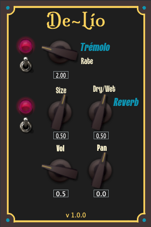

# De Lío

Tremolo and reverb audio plugin made with JUCE. The tremolo effect is produced by modulating the amplitude of the input signal with a sine low-frequency oscillator (LFO), while the reverb uses the algorithmic implementation of the Freeverb library available in the Juce::Reverb class.

The inspiration for the chosen effects and the name of the plugin comes from the Argentinian guitarist Ubaldo de Lío, who was one of the first guitarists to introduce electric guitars in tango music.

This plugin was developed as a final project for the course "Programación de plug-ins de audio" by [Ear Candy
Technologies](https://earcandytech.com/).